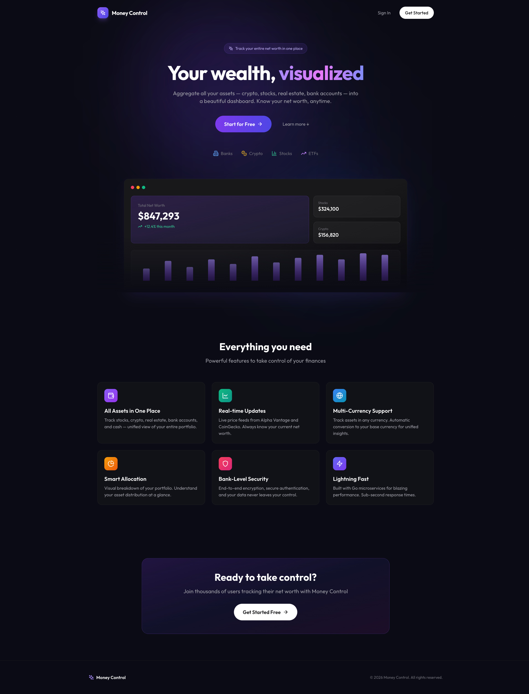
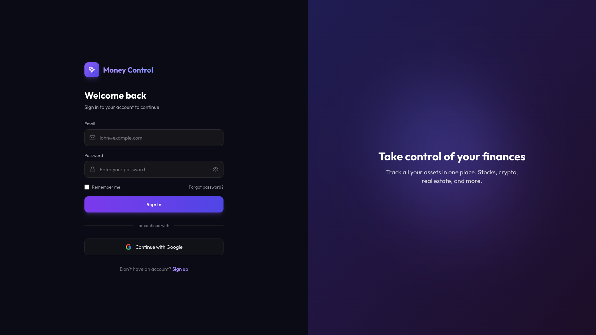
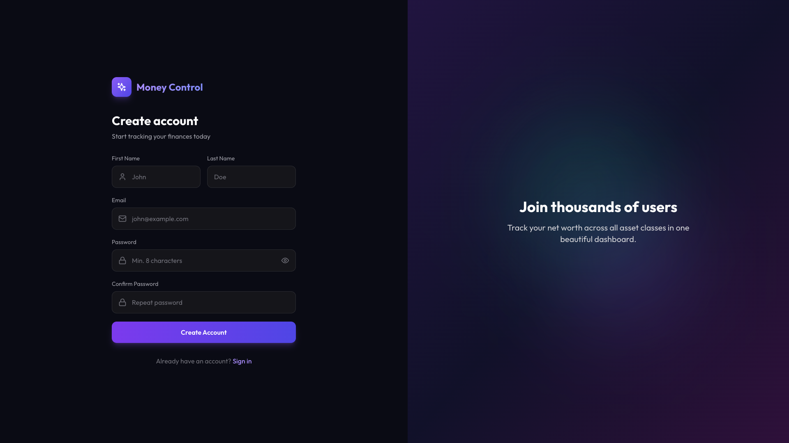
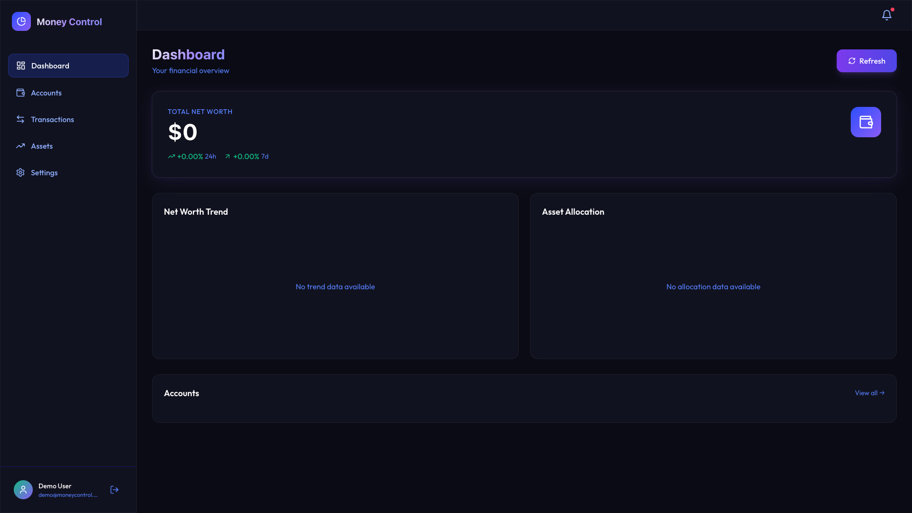
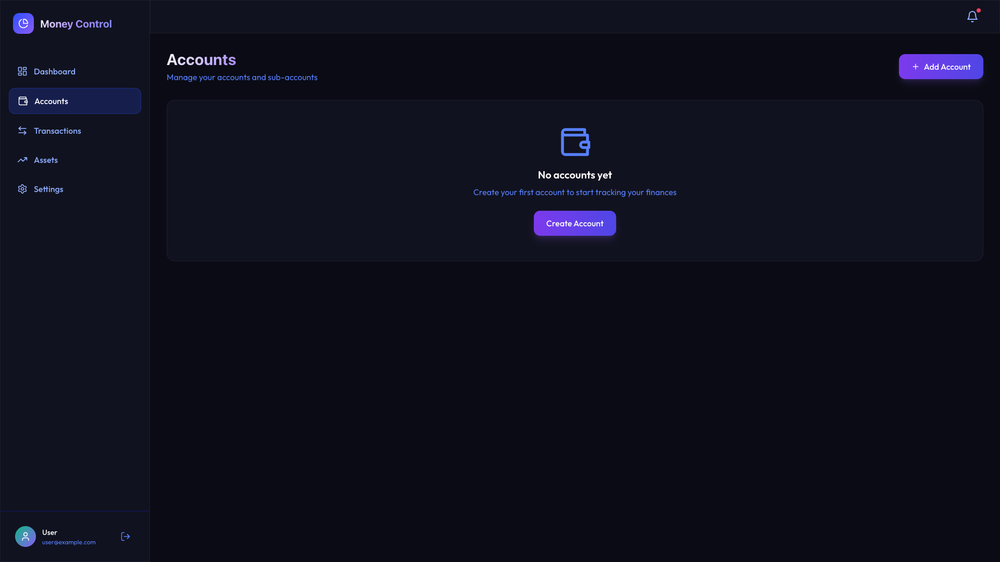
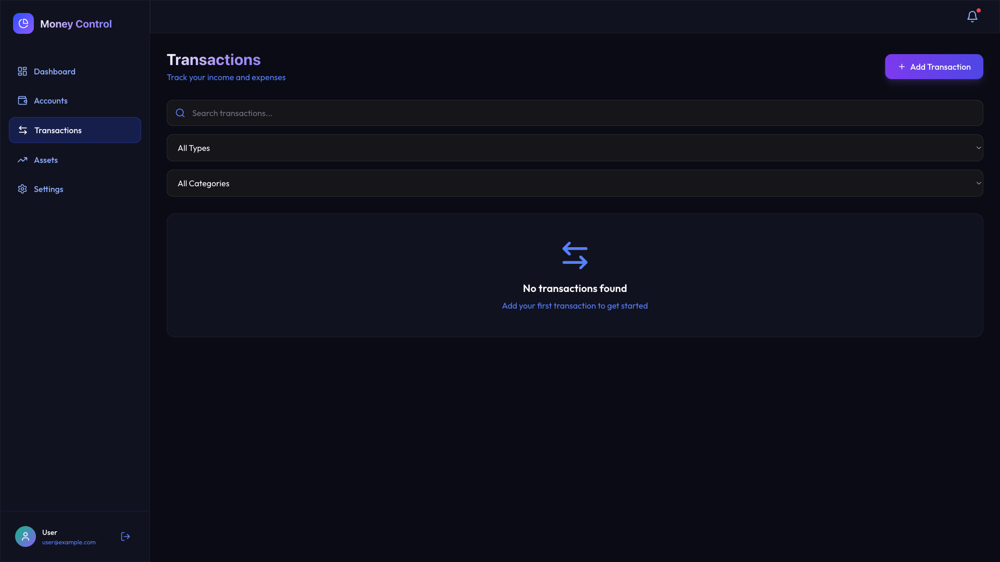

# Money Control 💰

A full-stack, microservices-based personal finance management application for comprehensive asset tracking. Track stocks, crypto, ETFs, real estate, bank accounts, and more in one unified dashboard.


<p align="center">
  
</p>

## 📖 Documentation

| Guide | Description |
|-------|-------------|
| [Getting Started](docs/guides/getting-started.md) | Quick start guide |
| [Google OAuth Setup](docs/guides/google-oauth.md) | Configure Google authentication |
| [Telegram Mini App](docs/guides/telegram-miniapp.md) | Set up Telegram integration |
| [API Reference](docs/api/README.md) | Full API documentation |

## ✨ Features

- 🏦 **Unified Net Worth Tracking** - Track all your assets in one place
- 💱 **Multi-Currency Support** - Sub-accounts in different currencies with automatic conversion
- 📈 **Real-time Asset Prices** - Integration with Alpha Vantage (stocks/ETFs) and CoinGecko (crypto)
- 📊 **Beautiful Dashboard** - Allocation charts, trends, and insights
- 🌐 **Cross-Platform** - Web, iOS, Android, and Telegram Mini App
- 🔐 **Secure Authentication** - JWT + Google OAuth + Telegram Auth
- 🏗️ **Microservices Architecture** - Scalable and maintainable design
- 🐳 **Docker Ready** - One command deployment

## 🖥️ Screenshots

<table>
  <tr>
    <td></td>
    <td></td>
  </tr>
  <tr>
    <td align="center"><b>Login</b></td>
    <td align="center"><b>Register</b></td>
  </tr>
  <tr>
    <td></td>
    <td></td>
  </tr>
  <tr>
    <td align="center"><b>Dashboard</b></td>
    <td align="center"><b>Accounts</b></td>
  </tr>
  <tr>
    <td colspan="2"></td>
  </tr>
  <tr>
    <td colspan="2" align="center"><b>Transactions</b></td>
  </tr>
</table>

## 🏗️ Architecture

```
┌─────────────────────────────────────────────────────────────────────┐
│                            Clients                                  │
│  ┌─────────────┐  ┌─────────────┐  ┌─────────────────────────────┐  │
│  │   Web App   │  │ Mobile App  │  │   Telegram Mini App + Bot   │  │
│  │   (React)   │  │(React Native│  │      (WebApp SDK)           │  │
│  └──────┬──────┘  └──────┬──────┘  └──────────────┬──────────────┘  │
└─────────┼────────────────┼───────────────────────┼──────────────────┘
          │                │                        │
          ▼                ▼                        ▼
┌─────────────────────────────────────────────────────────────────────┐
│                        API Gateway (Gin)                            │
│          Rate Limiting • JWT Validation • Logging • CORS            │
│                        Port: 9080                                   │
└───────────────────────────────┬─────────────────────────────────────┘
                                │ gRPC
          ┌─────────────────────┼─────────────────────┐
          ▼                     ▼                     ▼
┌─────────────────┐   ┌─────────────────┐   ┌─────────────────┐
│   Auth Service  │   │Accounts Service │   │  Transactions   │
│   PostgreSQL    │   │   PostgreSQL    │   │   PostgreSQL    │
│   Port: 50051   │   │   Port: 50052   │   │   Port: 50053   │
└─────────────────┘   └─────────────────┘   └─────────────────┘

┌─────────────────┐   ┌─────────────────┐   ┌─────────────────┐
│ Assets Service  │   │Currency Service │   │Insights Service │
│   PostgreSQL    │   │   PostgreSQL    │   │   PostgreSQL    │
│   + Redis       │   │   + Redis       │   │                 │
│   Port: 50054   │   │   Port: 50055   │   │   Port: 50056   │
└────────┬────────┘   └────────┬────────┘   └─────────────────┘
         │                     │
         ▼                     ▼
┌─────────────────────────────────────────────────────────────┐
│                      External APIs                          │
│     Alpha Vantage • CoinGecko • ExchangeRates.io            │
└─────────────────────────────────────────────────────────────┘
```

## 📁 Project Structure

```
money-control/
├── backend/
│   ├── proto/                    # Protocol Buffer definitions
│   ├── pkg/                      # Shared packages
│   └── services/
│       ├── auth/                 # Authentication (JWT, Google, Telegram)
│       ├── accounts/             # Accounts & sub-accounts management
│       ├── transactions/         # Transaction tracking
│       ├── assets/               # Asset management + price APIs
│       ├── currency/             # Currency exchange rates
│       ├── insights/             # Analytics and insights
│       └── gateway/              # API Gateway
├── frontend/
│   ├── web/                      # React + Vite + Tailwind
│   └── mobile/                   # React Native + Expo
├── docs/                         # Documentation
├── docker-compose.yml            # Docker orchestration
├── Makefile                      # Build automation
└── .env                          # Environment variables
```

## 📊 Tech Stack

| Layer | Technologies |
|-------|--------------|
| **Backend** | Go 1.24, Gin, gRPC, GORM, PostgreSQL, Redis |
| **Frontend** | React 18, Vite, TypeScript, Tailwind CSS, Redux Toolkit |
| **Mobile** | React Native, Expo |
| **Infrastructure** | Docker, Docker Compose, nginx |

## 📄 License

This project is licensed under the MIT License - see the [LICENSE](LICENSE) file for details.

---

<p align="center">
  Built with ❤️ for better financial tracking
</p>
